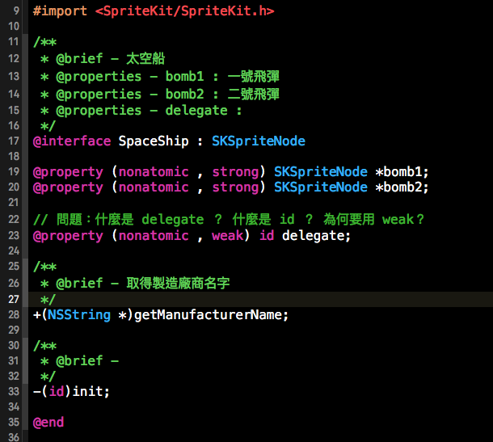
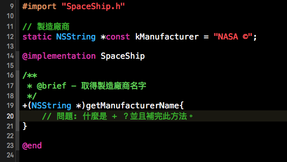
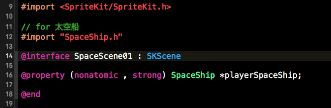
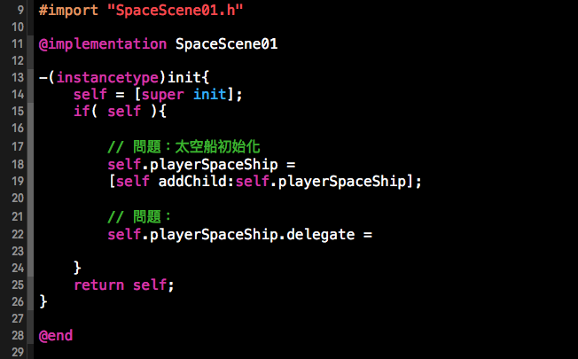

# 太空船與遊戲場景

### 問題描述（難度：★☆☆☆）：
#### 我們想設計一個簡單的遊戲架構：一艘太空船類別、一個太空的遊戲場景，然後太空船再遊戲場景上面飛行、並且可以發射飛彈。Objective-C 的程式碼如下：

圖片1：SpaceShip.h



圖片2：SpaceShip.m



#### 問題1：請問「圖片1」，第 28 行的 ```+(NSString *)getManufacturerName;``` 以及第 33 行的 ```-(id)init;``` 中 + 和 - 的用法有什麼差別？

#### 問題2：承問題1，請完成「圖片2」第 20 行的 ```+(NSString *)getManufacturerName;``` 的內容。（PS：廠商名稱可以用「圖片2」定義好的 NSString 來使用。）


圖片3: SpaceScene01.h



圖片4: SpaceScene01.m



#### 問題3：請完成「圖片4」內的第 18 行，太空船初始化。


#### 問題4：「圖片2」 的第12行，應該也可以寫成 ```#define``` 吧？為何這裡不是寫成 ```#define``` 而是用 ```static NSString *const```？（難度：★★★☆）

### 問題描述（難度：★★☆☆）：

#### 我們可以從「圖片1」看到 SpaceShip （太空船）有 bomb1 以及 bomb2 、兩顆炸彈的 property ，既然有炸彈，因此就可以發射炸彈，對吧？當玩家按下發射彈按鈕的時候，遊戲場景會出現飛彈物件發射出去，那是因為我們在遊戲場景上寫了個方法，讓飛機物件裡的砲彈物件飛移動。所以我們可以把炸彈移動 ```bombFlying``` 這個方法寫死在 SpaceScene01 （太空場景）上，然後讓飛彈從飛機發射出去後，飛彈就可以在太空場景上移動。
#### 但因為太空船可能除了 SpaceScene01 這張地圖以外，還可能運用在其他場景（打飛機遊戲總不能只有一個場景吧？），或是我們太空場景這次不是發射炸彈，而是發射雷射，那麼這個寫死的方法是不是就要拿掉不能用了？因此我們希望每個場景，在加入太空船後，都會「被動的」「被要求」去實作太空船本身的 ```bombFlying``` 這個方法，以達成類別與類別之間 __耦合度降低__ 、又能達成類別可以 __重複利用__ 的效果......

#### 問題1：接續上面的描述。因此在 Objective-C 中，我們都是怎麼做到 __耦合度降低__ 以及 __重複利用__ 的？簡單說明他的設計模式或是他的作法即可。（提示1：和「圖1」的第 28 行的 delegate 有關。）（提示2：官方一般 UI 元件都是用此方法設計的）


#### 問題2：接續問題1，請簡易的寫出如何實作的程式碼。

```

#import <SpriteKit/SpriteKit.h>

/**
 * @brief - 請在此實作 
 */
/************************/
// TODO: 降低耦合度
@___________ SpaceShipDelegate <NSObject>

// 飛彈移動的方法，可以使用題目給的方法名稱。
____________________;

@___

/**
 * @brief - 太空船
 * @properties - bomb1 : 一號飛彈
 * @properties - bomb2 : 二號飛彈
 * @properties - delegate : 
 */
@interface SpaceShip : SKSpriteNode

@property (nonatomic , strong) SKSpriteNode *bomb1;
@property (nonatomic , strong) SKSpriteNode *bomb2;

/************************/
// TODO: 降低耦合度
@property (nonatomic , weak) id <______________>delegate;

/**
 * @brief - 取得製造廠商名字
 */
+(NSString *)getManufacturerName;

/** 
 * @brief -
 */
-(id)init;

-(void)fireBomb:(int)bombIndex;

@end

```


```
#import "SpaceShip.h"

// 製造廠商
static NSString *const kManufacturer = "NASA ©";

@implementation SpaceShip

...

-(void)fireBomb:(int)bombIndex{
	[_delegate _____________________];
}

@end
```

遊戲場景

```
#import "SpaceScene01.h"

/************************/
// TODO: 降低耦合度
@interface SpaceScene01() < ________________ >
@end

@implementation SpaceScene01

-(instancetype)init{
    self = [super init];
    if( self ){
        
        // 問題：太空船初始化
        self.playerSpaceShip = 
        [self addChild:self.playerSpaceShip];
        
        // 問題：
        self.playerSpaceShip.delegate = 
        
    }
    return self;
}

/************************/
// TODO: 降低耦合度

@end

```


#### 問題3：請問什麼是 delegate？什麼是 id ？為何 delegate 要用 weak？


#### 問題4：你知道 objective-c 的 Category 嗎？簡單的說明一下 Category 、以及他可以達成什麼樣的功效？你什麼時候會想要使用 Category。
