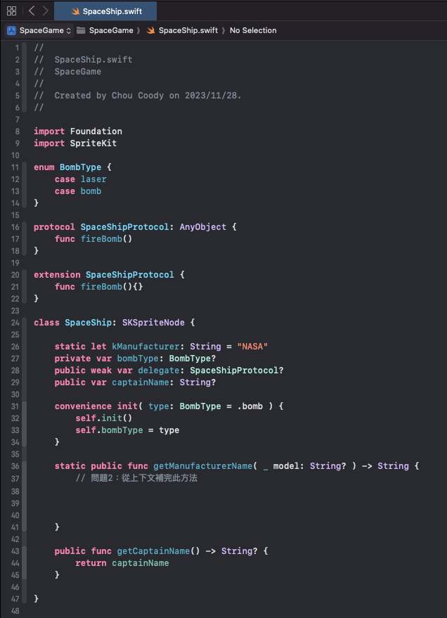
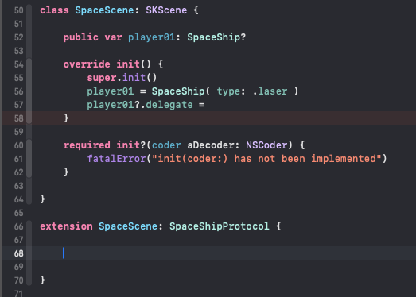

# 太空船與遊戲場景

### 變數、常數、方法（難度：★☆☆☆）：
#### 我們想設計一個簡單的遊戲架構：一艘太空船類別、一個太空的遊戲場景，然後太空船再遊戲場景上面飛行、並且可以發射飛彈。Swift 的程式碼如下：




圖片一：SpaceShip.swift

#### 問題1：請問「圖片1」，第 36 行的 ```static public func getManufacturerName()``` 以及第 43 行的 ```public func getCaptainName()``` 使用上有什麼差別？
<br>
<br>
<br>

#### 問題2：承問題1，請完成「圖片2」第 36 行 ```static public func getManufacturerName()``` 的 func 內容。
<br>
<br>
<br>

#### 問題3：請問 36 行的 func 的 ```-> String``` 跟 43 行的 ```-> String?``` 這兩個有什麼差別？另外 36 行的 function 設定 parameter 有底線 _ 跟沒底線有什麼差別？第 31 行的 ```convenience init( type: BombType = .bomb )``` 中的 = .bomb 有什麼作用？以及 convenience 是什麼意思？
<br>
<br>
<br>
<br>
<br>
<br>
<br>
<br>
<br>
<br>
<br>
<br>
<br>

### Protocol（難度：★★☆☆）：
#### 問題4：請問第 20 行的 extension 這樣設定 SpaceShipProtocol 是為了什麼理由？
<br>
<br>
<br>
<br>

#### 問題5：請問第 28 行的 delegate 為何要用 weak？
<br>
<br>
<br>
<br>
<br>
<br>



圖片二：SpaceScene.swift

#### 問題6：請完成「圖片二」內的第 57 行，太空船初始化。（請同時參考圖片一跟二）
<br>
<br>


#### 問題7：請問 66 行之下需要填入什麼？如果不填，理由又是什麼？（請同時參考圖片一跟二）
<br>
<br>
<br>
<br>

#### 問題8：請問 delegate 、 protocol 、 extension 、 class 、 struct 在 swift 語言中代表什麼意思？有什麼作用？
<br>
<br>
<br>
<br>
<br>
<br>
<br>
<br>
<br>
<br>
<br>
<br>
<br>
<br>
<br>
<br>


#### 問題9：（加分題）除了 delegate （ 代理 ）外，其實還有 closure （ 閉包 ），這兩個都是用來類別解耦的常用手段，請問一下這兩個各別有什麼優點？又有什麼缺點？
提示：解耦是程式設計架構上，用來將物件與物件之間分拆的一種技巧，方便物件重複利用、減少維護問題、跟提高工作效率與保持程式碼好味道的手段。
<br>
<br>
<br>
<br>
<br>
<br>
<br>
<br>
<br>
<br>
<br>
<br>
<br>
<br>
<br>

#### 問題9-2：（加分題）同上、那麼在使用 closure 上，我們常常會用 [weak self] in 或是 [unowned self] in ，這是為了什麼原因？
<br>
<br>
<br>
<br>
<br>
<br>
<br>
<br>
<br>

#### 問題10：（加分題）Swift 的 extension ( 也就是 Obj-C 的 category ) 跟 Objective-C 使用 category 兩個其實都能達成相同的作用，但 swift 的 extension 使用上有什麼的限制？該限制有沒有什麼方式來解決？
<br>
<br>
<br>
<br>
<br>
<br>


### Framework / Library（難度：★★★☆）(以下都加分題）：

#### 問題11：一般來說 Apple 的 library 的檔案格式是 *.a 、 *.framwrork ，這兩個有什麼差別？
<br>
<br>
<br>
<br>
<br>
<br>

#### 問題12：依據您的經驗，打包 framework 時，最常遇到的問題是什麼？怎麼解決？
<br>
<br>
<br>
<br>
<br>
<br>

#### 問題13：我們常常會需要邊開發主專案、一邊測試 Framework 修正的項目，但因為打包 Framework 會花很多時間，要及時更改也很麻煩，一般來說我們會用什麼方法來邊開發專案、邊修改 Framework 的內容？
<br>
<br>
<br>
<br>
<br>
<br>

#### 問題14：你再建立 Framework 或是 Library 時，有遇到什麼狀況嗎？分享一下。（可口頭詳聊）
<br>
<br>
<br>
